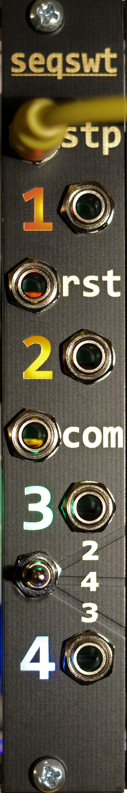
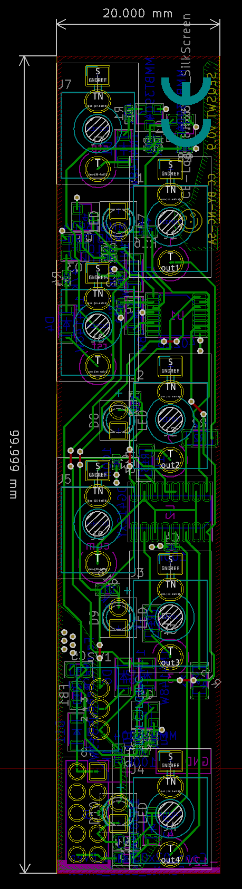

# seqswt eurorack 4(3,2) to 1 sequential switch

## v0.9

Label 2 and 3 at the switch are reversed.

  * 4hp
  * +/-12V 10mA/1mA
  * 1 PCB 2 layer
  * common jack is connected to one output at a time
    * DG412 Rail2Rail analog switch recommended
  * step input
    * move to next position
    * TN pin header on pcb
  * reset input
    * move to step 1
    * locked on step 1, while gate high.

Schematic and layout with KiCad 5. Panel with Inkscape + shenzen2svg → Kicad

Ordered mine at JLCPCB. Added ICs by hand. Gerbers include marking for order number. BOM with part numbers for their assembly service.